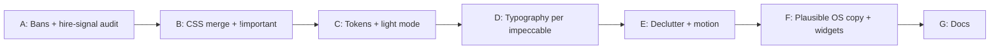

# xiaoOS design critique — implementation plan (revised)

**Branch:** `main` (as of last verify: `main...origin/main`).  
**Design source of truth:** [`.impeccable.md`](.impeccable.md) — hiring-first clarity, **confidence** as first impression, plausible xiaoOS (not surveillance cosplay), impeccable **absolute bans** and UX rules.  
**Legacy doc:** [STYLE.md](STYLE.md) may still describe surveillance framing / gradients — treat as **legacy** unless explicitly updated; implementation should **not** reintroduce those patterns.

**Owner constraint — startup animation:** **Keep the existing xiaoOS startup animation** as implemented today: preserve [src/components/StartupAnimation.ts](src/components/StartupAnimation.ts) behavior, structure, and timing, plus the related loader markup/CSS (e.g. `.xiaoos-loader-container`, `.xiaoos-display-area`, strike bars, diamond, shapes, progress, `terminal-boot` entry). Refactors may **reorganize CSS** or **tune colors/tokens** so it still matches the same experience; do **not** replace it with a different intro or strip the sequence. Optional **copy-only** changes to boot strings are fine if they stay plausible-OS and you want them.

---

## Verified baseline on this branch

| Item | State |
|------|--------|
| CSS entry | [postcss.config.js](postcss.config.js) → `postcss src/styles/main.css` → `static/css/main.css` |
| Second sheet | **Merged** — former `nexus-newstyle.css` is appended at the end of [src/styles/main.css](src/styles/main.css); PostCSS no longer uses a separate append step |
| Line counts (approx.) | Single `main.css` ~**41xx** lines (includes merged block + xiaoOS loader rules) |
| `!important` | Still present in merged block — further cascade cleanup optional |
| Impeccable **BAN: gradient text** | **Addressed** — `.nexus-title` / `.highlight` use solid colors |
| Impeccable **BAN: side-stripe** | **Addressed** for `.security-notice`; corner L-brackets (`corner-accent-*`) are decorative frames, not callout stripes |
| Templates | [templates/base.html](templates/base.html) uses `game-ui-layout` (HUD shell is live) |

---

## How this plan differs from the original critique plan

1. **Anchored to `.impeccable.md`** — Success includes **scannable hire signal** (role, stack, proof) and **trust/confidence**, not only “fewer neon glows.”
2. **Branch-specific numbers** — `nexus-newstyle` on `main` is **~1008** lines (not ~2k); merge scope is smaller than the outdated UI branch assumption.
3. **Typography** — Do **not** blindly pick “IBM Plex” or any [reflex list](https://github.com/) font from the impeccable skill. When changing fonts, follow the skill’s **font_selection_procedure** (brand words → reject reflex fonts → catalog browse → cross-check). Document the chosen pair in `STYLE.md` / tokens.
4. **Accessibility** — Per Design Context: **best-effort** (semantics, focus, contrast, `prefers-reduced-motion`), not a WCAG AA certification unless you scope it later.
5. **`STYLE.md`** — Schedule an explicit pass to align copy with `.impeccable.md` (remove surveillance/gradient hero guidance where it conflicts).

---

## Phased implementation

### Phase A — Absolute bans + hiring-first signal (P0)

- Remove **gradient text** on `.nexus-title` / `.highlight` (solid colors + weight/size for emphasis), **or** delete the rules if unused (grep `templates/` + `src/`).
- Remove **forbidden side-stripe** patterns on callouts/alerts (e.g. `.security-notice`); replace with full border, tint, or structure change per impeccable — not a 2px colored `border-left` accent.
- **Content/layout:** Ensure above-the-fold or early viewport surfaces **role, stack, and proof** (bio, projects, resume links) — aligns with *Hiring-first clarity*.

### Phase B — CSS architecture (P1)

- Merge `nexus-newstyle.css` into a **single maintainable pipeline**: append block at end of `main.css`, or `@import` with postcss-import; then **remove** [postcss.config.js](postcss.config.js) `appendNexusNewstylePlugin` and delete the standalone file once merged.
- Eliminate `!important` by fixing cascade (one source of truth per component); expect to touch both former files’ rules.

### Phase C — Color + theme tokens (P2 + P6)

- **` :root`** OKLCH tokens: `--color-bg`, `--color-text`, `--color-muted`, borders, `--accent-interactive`, `--accent-status`, `--accent-data`; tint neutrals toward brand hue per impeccable color principles.
- **`.light-mode`** on `html`/`body`: override **variables only** where possible; shrink hundreds of one-off `.light-mode .foo` rules over time.
- **Tailwind** [tailwind.config.js](tailwind.config.js): map `surface` / accents to `var(...)` where templates use utilities.

### Phase D — Typography (P3)

- Run impeccable **font_selection_procedure**; pair **display + body** without reflex fonts; load via Google Fonts / self-host as chosen.
- **Product UI note:** Skill prefers fixed `rem` scales for dashboards vs fluid marketing — this portfolio is **OS/HUD**; use a **clear modular scale** (few sizes, ≥~1.25 ratio between steps) and comfortable line-height on dark (slightly looser body).
- Update [templates/base.html](templates/base.html) (and [templates/terminal.html](templates/terminal.html) if it loads fonts separately).

### Phase E — Visual declutter + motion (P4)

- Apply declutter primarily to **main site** chrome (nav, panels, cards, typography defaults) — **not** as an excuse to delete or simplify the **startup loader** (see owner constraint above). Loader may use **text-shadow** / motion as part of its fiction.
- **text-shadow:** Reserve for boot/loader fiction and intentional “live” status — not default headings on the main portfolio shell.
- **backdrop-filter:** Prefer **nav** + **modal/overlay** only; remove decorative glass on panels/cards where it reads as slop.
- **box-shadow:** Subtle elevation; accent glow only for focus/active status where meaningful.
- **z-index:** Token scale (`--z-nav`, `--z-modal`, `--z-boot`, etc.) — keep loader above content (`--z-boot` / existing stacking).
- **`prefers-reduced-motion`:** Keep current behavior (e.g. skip or shorten intro when reduced motion is on); do not remove the animation path for users who want the full intro.

### Phase F — Plausible fiction + trust (P5)

- [src/utils/surveillanceWindows.ts](src/utils/surveillanceWindows.ts): Reframe ambient panels as **OS widgets** (clock, resource status, recent tasks) — not surveillance theater (*Plausible fiction* + *confidence*).
- [src/utils/glitchAnimations.ts](src/utils/glitchAnimations.ts): Remove gimmick effects (e.g. data corruption) that undermine trust; **do not** remove or replace the **startup** experience — that lives in `StartupAnimation` / boot flow.
- [src/components/StartupAnimation.ts](src/components/StartupAnimation.ts): **Preserve** the animation (sequence, GSAP-style orchestration, loader DOM). Optional: adjust **boot strings only** toward plausible OS copy; no wholesale rewrite of the intro unless you explicitly choose to later.

### Phase G — Documentation

- Update [STYLE.md](STYLE.md): tokens, fonts, file layout, and **explicitly deprecate** gradient hero / heavy surveillance language that conflicts with `.impeccable.md`.

---

## Files likely touched

| File | Role |
|------|------|
| `src/styles/main.css` | Bans, tokens, base type, merge target |
| ~~`src/styles/nexus-newstyle.css`~~ | **Done** — merged into `main.css`; file removed |
| `postcss.config.js` | Remove append plugin after merge |
| `tailwind.config.js` | Colors, fonts, z-index |
| `templates/*.html` | Classes, font links, hire-signal order |
| `src/utils/surveillanceWindows.ts`, `glitchAnimations.ts` | Widgets + effects |
| `src/components/StartupAnimation.ts` | **Keep animation**; optional copy tweaks only |
| `STYLE.md` | Align with `.impeccable.md` |
| `.impeccable.md` | No change unless you refine teach answers |

---

## Branch scope

**`main` only.** The old `codex/portfolio-ui-refinement` UI experiment is out of scope (local branch removed; associated stash dropped). If a matching branch still exists on `origin`, delete it from the remote when you no longer need it. Re-run the audit only if you intentionally revive or merge different UI work.

---

## Suggested todos (for issue tracker / Cursor)

1. P0: Fix gradient text + stripe bans; verify hire-signal above fold  
2. P1: Merge CSS; remove PostCSS append; reduce `!important`  
3. P2/P6: OKLCH tokens + variable-driven light mode  
4. P3: Fonts per impeccable procedure + type scale  
5. P4: Shadow / backdrop / z-index / reduced-motion  
6. P5: surveillanceWindows + glitch; StartupAnimation **copy only** (animation preserved)  
7. G: STYLE.md alignment  
